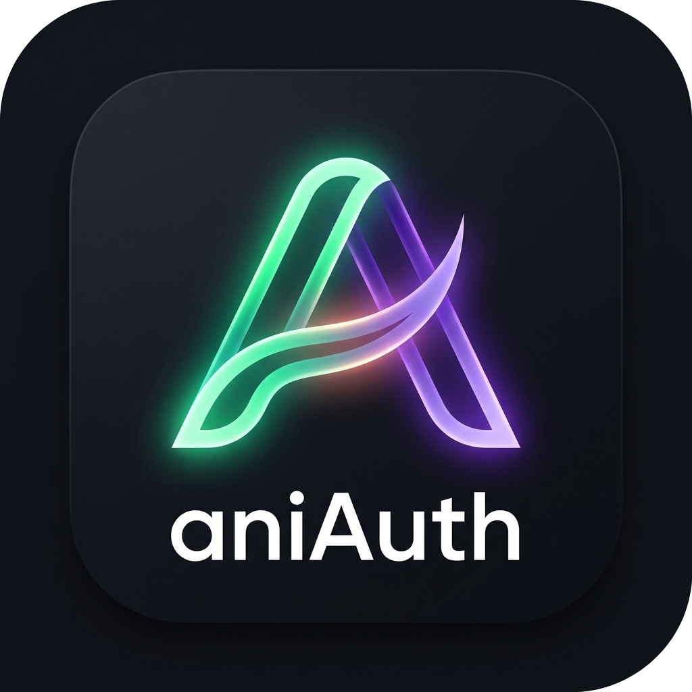

<p align="center">
  
</p>

<h1 align="center">aniAuth</h1>

<p align="center">
  <strong>A minimalist, secure, and aesthetic TOTP authenticator for Android and Wear OS.</strong>
</p>

<p align="center">
  <a href="https://developer.android.com"></a>
  <a href="https://kotlinlang.org"></a>
  <a href="https://developer.android.com/jetpack/compose"></a>
  
  
  <a href="LICENSE"></a>
</p>

<p align="center">
  <a href="https://github.com/anishcreations/aniAuth/releases/tag/v1.3.0"></a>
  <a href="https://github.com/anishcreations/aniAuth/releases#release-wear-v1.0.0"></a>
</p>

<p align="center">
  aniAuth is a local-first, privacy-focused 2FA authenticator combining aesthetic UI designs with hardware-backed encryption to secure your accounts on your phone and watch.
</p>

---

> [!NOTE]
> For release logs, see [CHANGELOG.md](CHANGELOG.md). All details regarding the Wear OS companion app (features, setup, security, and codebase structure) can be found in [WEAROS.md](WEAROS.md).

## Table of Contents
- [Features](#features)
- [Wear OS Companion App](WEAROS.md)
- [Security and Threat Model](#security-and-threat-model)
- [Codebase Structure](#codebase-structure)
- [Compatibility and Imports](#compatibility-and-imports)
- [How It Works Under the Hood](#how-it-works-under-the-hood)
- [Build and Installation](#build-and-installation)
- [Contact and Feedback](#contact-and-feedback)
- [License](#license)

---

## Features

### Seamless Setup
- **High-Speed QR Scanner**: Built using Google ML Kit Vision API. Uses a dynamic thin client via Google Play Services to keep the APK build size and post-installation footprint extremely lightweight.
- **Manual Entry**: Polished form with field validation for adding keys with custom labels and names.

### Premium Security
- **Hardware-Backed Encryption**: Master encryption keys are stored securely within the device's Secure Element (SE) or Trusted Execution Environment (TEE) via the Android KeyStore.
- **Biometric & Device Lock**: Optional biometric prompt (fingerprint or face unlock) required on app startup, with native device credentials (PIN/pattern/password) fallback to prevent lockouts.
- **Zero Network Footprint**: Fully offline. The app requests no internet permission whatsoever. (Note: Google Play Services handles ML model downloads at the OS level, keeping the app completely sandboxed from the network).

### Aesthetic UI/UX
- **Aesthetic Light & Dark Themes**: Modern, high-contrast themes built with Jetpack Compose Material 3. Features a premium "Obsidian-Violet" dark mode, and a sleek, high-readability light mode.
- **Dynamic Theme Selector**: Choose between Light Mode, Dark Mode, or System Default dynamically in the settings panel.
- **Dedicated Settings Screen**: Access theme configurations, data management (encrypted backups/imports), biometric security toggles, policy details, and guides in one centralized screen.
- **Dynamic User Manual**: Soothing, accessible guide detailing app controls, shortcuts, backups, and usage.
- **Integrated Search & Timer**: Unified search bar and countdown timer in a sleek pill header. Displays a soft-toned refresh message that collapses into an active search field with automatic keyboard focus on click.
- **One-Tap Copy**: Tap any card to copy the code directly to your clipboard.
- **Flexible Backup Exports**: Export backups in secure Encrypted format (AES-256 encrypted with aniAuth's internal key) or Decrypted format (plaintext JSON) with built-in warnings.
- **Account Management**: Long-press any card to securely view decrypted secret keys, edit account metadata, or delete credentials.
- **Adaptive Launcher Icon**: Creative geometric "A" icon with glowing arches designed for modern home screen styling.

---

## Security and Threat Model

### 1. Data Encryption (At Rest)
All account data is stored locally in `SharedPreferences`. The raw shared secrets are encrypted using the AES/GCM/NoPadding cipher.
* **Key Generation**: A 256-bit AES master key is generated inside the Android KeyStore using the `KeyGenParameterSpec` builder with GCM block mode and no padding.
* **Key Isolation**: The master key remains isolated in hardware (TEE/SE) and cannot be extracted in plain text by the operating system or other apps.
* **Payload Encryption**: For each account, the secret is encrypted with a unique initialization vector (IV). The IV (12 bytes) and cipher text are combined, Base64-encoded, and saved to disk.

### 2. Encrypted Backups
When exporting backups, data security is maintained through a combination of key derivation and GCM encryption:
* **Key Derivation (KDF)**: A strong 256-bit AES key is derived from the backup password using **PBKDF2WithHmacSHA256** with 10,000 iterations and a cryptographically secure 16-byte salt.
* **Encryption**: The JSON payload (with decrypted secrets) is encrypted with the derived key using **AES/GCM/NoPadding** and a secure 12-byte IV.
* **Export Payload**: The exported file is formatted as a Base64 string containing: `salt (16 bytes) + IV (12 bytes) + encrypted payload`.

---

## Codebase Structure

```
aniAuth/
├── app/
│   ├── src/
│   │   ├── main/
│   │   │   ├── java/com/aniauth/authenticator/
│   │   │   │   ├── crypto/
│   │   │   │   │   ├── BackupManager.kt      # Encrypted backup & import engine
│   │   │   │   │   ├── KeyStoreHelper.kt     # Hardware-backed AES encryption (key: AniAuthMasterKey)
│   │   │   │   │   ├── OtpAuthParser.kt      # Parse otpauth:// URIs
│   │   │   │   │   └── TotpGenerator.kt      # RFC 6238 TOTP calculator
│   │   │   │   ├── model/
│   │   │   │   │   ├── Account.kt            # Data model representing a 2FA account
│   │   │   │   │   ├── AccountRepository.kt   # Local storage and CRUD operations
│   │   │   │   │   └── AccountSerializer.kt   # JSON serialization for backup/import
│   │   │   │   ├── ui/
│   │   │   │   │   ├── screens/
│   │   │   │   │   │   ├── AddAccountScreen.kt
│   │   │   │   │   │   ├── BiometricLockScreen.kt
│   │   │   │   │   │   ├── DashboardScreen.kt
│   │   │   │   │   │   ├── ScannerScreen.kt
│   │   │   │   │   │   ├── AccountDetailsScreen.kt
│   │   │   │   │   │   └── SettingsScreen.kt
│   │   │   │   │   └── theme/
│   │   │   │   │       ├── Color.kt
│   │   │   │   │       └── Theme.kt
│   │   │   │   └── MainActivity.kt           # App lifecycle & entry point
│   │   │   └── AndroidManifest.xml
│   └── build.gradle.kts
├── wearos/                                    # Wear OS companion module
│   ├── src/
│   │   ├── main/
│   │   │   ├── java/com/aniauth/authenticator/wearos/
│   │   │   │   ├── crypto/
│   │   │   │   │   ├── KeyStoreHelper.kt     # Watch-local AES encryption (key: AniAuthWatchMasterKey)
│   │   │   │   │   └── TotpGenerator.kt      # Standalone RFC 6238 TOTP calculator
│   │   │   │   ├── model/
│   │   │   │   │   ├── Account.kt            # Watch account data model
│   │   │   │   │   └── WatchRepository.kt    # Watch-local storage with decryption cache
│   │   │   │   ├── sync/
│   │   │   │   │   └── WearSyncService.kt    # Wearable Data Layer message listener
│   │   │   │   └── MainActivity.kt           # Watch UI: PIN lock, keypad, dashboard
│   │   │   └── AndroidManifest.xml
│   └── build.gradle.kts
├── build.gradle.kts
├── settings.gradle.kts
├── CHANGELOG.md
├── WEAROS.md                                  # Wear OS companion documentation
├── LICENSE
└── README.md
```

---

## Compatibility and Imports

aniAuth makes migrating from other password managers and authenticators seamless by offering smart one-way imports:
* **Bitwarden Vault Exports**: Import Bitwarden's JSON vaults directly. The app will extract TOTP secrets from the standard `login.totp` field nested inside items.
* **Universal Parser**: The importer automatically parses common properties like `secret`, `key`, `encryptedSecret`, `label`, `name`, `issuer`, and `username` to build the credentials list.
* **Double-Encryption Safety**: On import, plain text secrets are parsed, encrypted via the device's hardware KeyStore immediately, and then written to the database.

---

## How It Works Under the Hood

### 1. Account Storage & Encryption Pipeline
When you add an account (via QR scan, manual entry, or import), the following happens:

1. **Secret Extraction**: The raw Base32 secret is extracted from the `otpauth://` URI (via `OtpAuthParser`) or from the manual entry form.
2. **Immediate Encryption**: The plaintext secret is passed to `KeyStoreHelper.encrypt()` *before* it ever touches disk. A 256-bit AES master key (alias: `AniAuthMasterKey`) stored inside the Android KeyStore's TEE/SE hardware enclave performs AES-GCM encryption. The system generates a cryptographically random 12-byte IV for each encryption operation.
3. **Combined Payload**: The IV (12 bytes) and ciphertext are concatenated into a single byte array and Base64-encoded (using `Base64.NO_WRAP`).
4. **Disk Write**: The Base64-encoded blob is saved as the `encryptedSecret` field inside a JSON array stored in `SharedPreferences` (file: `ani_auth_prefs`). The plaintext secret is never written to disk.
5. **Decryption Cache**: On read, `KeyStoreHelper.decrypt()` uses a thread-safe `ConcurrentHashMap` to cache previously decrypted values in memory only. This avoids repeated hardware KeyStore calls during UI scrolls and recompositions, keeping the dashboard at a smooth 60fps.

### 2. RFC 6238 TOTP Code Generation
The `TotpGenerator` implements the standard TOTP algorithm:

1. The Base32-encoded secret is cleaned (whitespace/hyphens stripped, uppercased) and decoded into raw bytes using a custom Base32 decoder.
2. The current Unix epoch (seconds) is divided by the time interval (default: **30 seconds**) to compute the current time step.
3. The time step is packed into an **8-byte big-endian `ByteBuffer`**.
4. An **HMAC-SHA1** hash is computed over the time step bytes using the decoded secret as the MAC key.
5. **Dynamic truncation**: The last 4 bits of the 20-byte HMAC hash determine an offset. A 4-byte segment is extracted starting at that offset, with the high bit masked off (`& 0x7f`).
6. The 31-bit integer is reduced to 6 digits via `binary % 1,000,000` and zero-padded with `String.format("%06d", otp)`.

### 3. Backup Export Mechanics
aniAuth offers two export formats, both requiring biometric/device credential verification first:

#### Encrypted Backup
1. `AccountSerializer.toJson(accounts, decryptSecrets = true)` decrypts every account secret from the KeyStore so the backup contains portable, plaintext Base32 keys.
2. The JSON payload is encrypted by `BackupManager.encrypt()` using a hardcoded internal backup password:
   - A **16-byte cryptographic salt** is generated via `SecureRandom`.
   - A **256-bit AES key** is derived from the password using **PBKDF2WithHmacSHA256** with **10,000 iterations**.
   - A **12-byte IV** is generated via `SecureRandom`.
   - The JSON is encrypted with **AES/GCM/NoPadding** using a **128-bit authentication tag**.
3. The output file contains: `Base64(salt[16] + IV[12] + ciphertext)`.

#### Decrypted Backup
1. The same `toJson(decryptSecrets = true)` call produces portable JSON.
2. The raw JSON is written directly to the `.json` file with no additional encryption.

### 4. Import Pipeline & Compatibility
The `AccountSerializer.fromJson()` parser handles multiple formats:

1. **aniAuth native format**: Direct JSON array of `{id, label, encryptedSecret, username}` objects.
2. **Bitwarden Vault exports**: Detects `items[]` → `login.totp` nested structure, parses `otpauth://` URIs via `OtpAuthParser`.
3. **Universal fallback**: Searches for common field names (`secret`, `key`, `encryptedSecret`, `name`, `label`, `issuer`, `username`) and auto-extracts credentials.
4. **Re-encryption**: On import, `MainActivity` validates each secret via `TotpGenerator.isValidSecret()`, encrypts valid keys with the device's KeyStore, and skips invalid/un-decodable entries (reporting the skip count to the user).

### 5. Wear OS Sync Flow
> For full details on the watch companion module, see [WEAROS.md](WEAROS.md).

1. The phone app queries `Wearable.getNodeClient()` to detect connected watches. The "Sync to Watch" settings row only appears when a paired node is found.
2. On tap, biometric authentication is required. After verification, `AccountSerializer.toJson(accounts, decryptSecrets = true)` produces a JSON payload with plaintext Base32 secrets.
3. The payload is transmitted via `Wearable.getMessageClient().sendMessage()` over the `/sync-accounts` path through the Bluetooth data layer.
4. On the watch, `WearSyncService` (a `WearableListenerService`) receives the message, validates each secret via `TotpGenerator.isValidSecret()`, re-encrypts each key using the **watch's own independent KeyStore master key** (alias: `AniAuthWatchMasterKey`), and saves the encrypted accounts to the watch's local `SharedPreferences`.
5. The watch then generates TOTP codes independently using its own local clock and its own copy of `TotpGenerator` — no phone connection required after the initial sync.

## Build and Installation

### Pre-built Downloads
Skip compiling from source and grab the latest pre-compiled packages directly:
* 📱 **Android Phone App**: [aniAuth-phone-v1.3.0.apk](https://github.com/anishcreations/aniAuth/releases/tag/v1.3.0)
* ⌚ **Wear OS Companion App**: [aniAuth-wear-v1.0.0.apk](https://github.com/anishcreations/aniAuth/releases#release-wear-v1.0.0) — *(See [Watch Installation & Sideloading Guide](WEAROS.md#watch-installation-guide))*

### Prerequisites
* **JDK 17** or higher
* **Android SDK** (API 26+)
* **Android Studio Koala (or newer)** or command-line tools

### Building from Source
1. Clone the repository:
   ```bash
   git clone https://github.com/anishcreations/aniAuth.git
   cd aniAuth
   ```
2. Build the Debug APK:
   ```bash
   ./gradlew assembleDebug
   ```
3. Install the APK on a connected device/emulator:
   ```bash
   ./gradlew installDebug
   ```

## Contact and Feedback

If you encounter bugs, have feature suggestions, or want to share feedback:
* **Email**: Contact us at [anish.creations.hq@gmail.com](mailto:anish.creations.hq@gmail.com?subject=%5BaniAuth%20Android%5D%20Support%20/%20Feedback). Please keep the prefilled subject line intact.
* **Website**: You can also contact me directly via [anisharyal09.com.np](https://anisharyal09.com.np/#contact) (for any support, features, or bugs).
* **GitHub Issues**: You can report issues, request features, or submit pull requests directly on the repository's [issues page](https://github.com/anishcreations/aniAuth/issues).

---

## License

This project is licensed under the Apache License 2.0 - see the [LICENSE](LICENSE) file for details.
